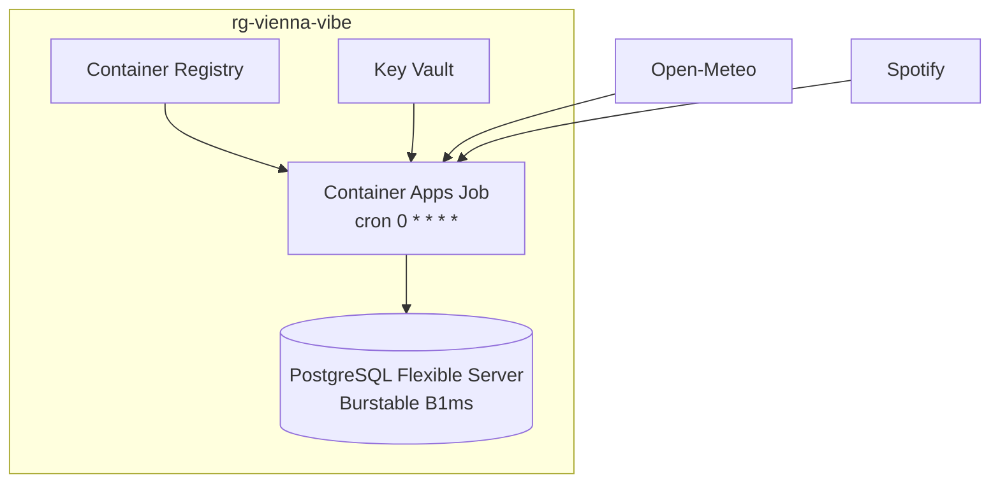

# Azure deployment

## What gets created



## Why a Container Apps Job

The pipeline runs for about a minute every hour. A VM running Airflow would be
billed for 720 hours a month to do 12 hours of work. Azure Functions would work
too, but I already had a container image and did not want to repackage it for a
different runtime. A Container Apps Job is billed per second of execution,
takes the image as-is, and has cron scheduling built in.

It also means the image running in production is the same one the tests ran
against, so there is no gap between what I verified and what is deployed.

## Prerequisites

An Azure subscription, the Azure CLI, and `az login`. The free tier covers
twelve months of PostgreSQL Flexible Server at the B1ms tier.

Docker is not needed. `az acr build` builds the image on Azure.

## Deploy

```powershell
cd infra/azure
./deploy.ps1 -SpotifyClientId "..." -SpotifyClientSecret "..." -SpotifyRefreshToken "..."
```

Linux or macOS:

```bash
SPOTIFY_CLIENT_ID=... SPOTIFY_CLIENT_SECRET=... SPOTIFY_REFRESH_TOKEN=... ./deploy.sh
```

Every resource is checked before it is created, so re-running the script
updates the image without recreating anything. First run takes about fifteen
minutes, most of it waiting on Postgres.

The script applies the schema through a separate one-off job before enabling
the scheduled one. Without that the first hourly run would fail on missing
tables.

## Operating it

```bash
# run now instead of waiting for the hour
az containerapp job start -g rg-vienna-vibe -n job-viennavibe-hourly

# execution history
az containerapp job execution list -g rg-vienna-vibe -n job-viennavibe-hourly -o table

# logs
az containerapp job logs show -g rg-vienna-vibe -n job-viennavibe-hourly --container vienna-vibe

# how much data is in there
psql "$DATABASE_URL" -c "SELECT * FROM marts.v_project_stats;"

# is the pipeline healthy
psql "$DATABASE_URL" -c "SELECT * FROM marts.v_pipeline_health;"
```

## Secrets

The four secrets live in Key Vault with RBAC authorisation. The job reads them
as `secretref:` references rather than plaintext values in its definition.
Postgres requires `sslmode=require`, and the container runs as a non-root user.

## Tearing it down

```powershell
./teardown.ps1
```

Deletes the resource group and purges the vault, which Azure otherwise keeps in
soft-delete for 90 days and which blocks reusing the name. Worth doing on a
personal project: infrastructure you forget about is a bill that keeps running.
