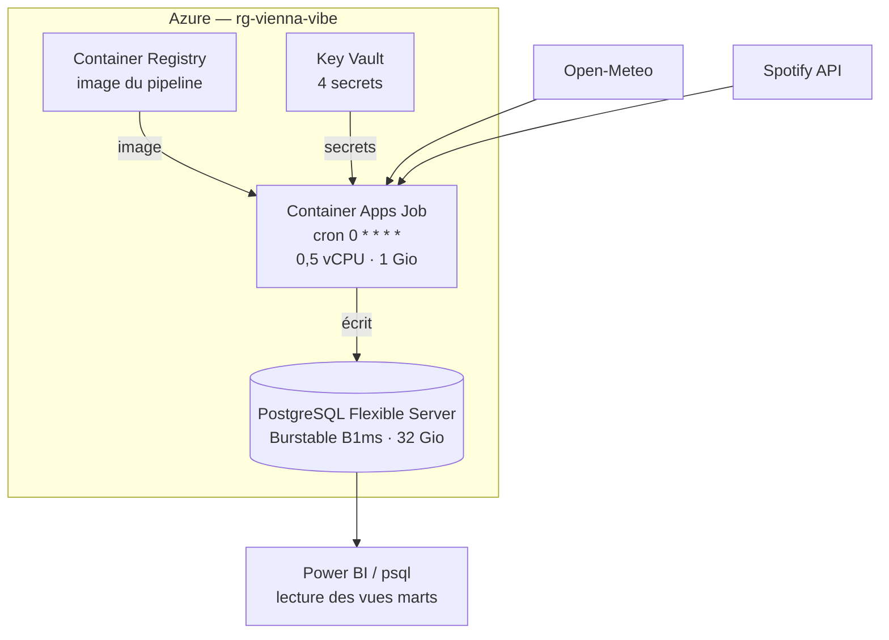

# Déploiement sur Azure

Le pipeline tourne en production sur Azure, sans serveur à administrer.

## L'architecture retenue



## Pourquoi un Container Apps Job

Le pipeline s'exécute environ une minute par heure, soit 24 minutes de calcul
par jour. Trois options étaient possibles :

| Option | Coût mensuel indicatif | Verdict |
|---|---|---|
| VM avec Airflow | machine allumée 24 h/24 | Payer 720 heures pour 12 heures de travail. Absurde à cette échelle. |
| Azure Functions | très faible | Contrainte de durée d'exécution et empaquetage différent du conteneur déjà écrit. |
| **Container Apps Job** | **quelques euros** | Facturé à la seconde d'exécution, réutilise l'image Docker existante, ordonnancement cron intégré. |

Le choix du serverless n'est pas une mode : c'est le seul qui aligne le coût
sur l'usage réel. Et l'image déployée est exactement celle testée en local,
donc aucun écart entre développement et production.

Airflow reste dans le dépôt (`dags/`) pour le développement local et pour
démontrer la compétence d'orchestration. En production, Azure assure
l'ordonnancement, les reprises et les journaux.

## Prérequis

- Un abonnement Azure. L'offre gratuite couvre douze mois de PostgreSQL
  Flexible Server au palier B1ms.
- Azure CLI installé, puis `az login`.
- Docker **n'est pas nécessaire** : l'image est construite côté Azure par
  `az acr build`.

## Déploiement

Sur Windows :

```powershell
cd infra/azure
./deploy.ps1 -SpotifyClientId "..." -SpotifyClientSecret "..." -SpotifyRefreshToken "..."
```

Sur Linux ou macOS :

```bash
cd infra/azure
SPOTIFY_CLIENT_ID=... SPOTIFY_CLIENT_SECRET=... SPOTIFY_REFRESH_TOKEN=... ./deploy.sh
```

Le script est **idempotent** : chaque ressource est vérifiée avant création,
donc on peut le relancer pour mettre à jour l'image sans rien recréer. Compter
une quinzaine de minutes au premier passage, l'essentiel étant la création du
serveur PostgreSQL.

Il applique aussi le schéma avant de planifier le job, via un job ponctuel
séparé. Sans cela, la première exécution horaire échouerait sur des tables
absentes.

## Exploitation

```bash
# Déclencher une exécution sans attendre l'heure
az containerapp job start -g rg-vienna-vibe -n job-viennavibe-hourly

# Historique des exécutions
az containerapp job execution list -g rg-vienna-vibe -n job-viennavibe-hourly -o table

# Journaux de la dernière exécution
az containerapp job logs show -g rg-vienna-vibe -n job-viennavibe-hourly --container vienna-vibe

# Les chiffres du projet
psql "$DATABASE_URL" -c "SELECT * FROM marts.v_project_stats;"

# Santé du pipeline
psql "$DATABASE_URL" -c "SELECT * FROM marts.v_pipeline_health;"
```

## Sécurité

- Les quatre secrets vivent dans **Key Vault**, avec autorisation par RBAC.
  Rien dans le dépôt, rien dans l'historique Git.
- Le job lit ses secrets via des références (`secretref:`) et non des valeurs
  en clair dans sa définition.
- PostgreSQL impose `sslmode=require`.
- Le conteneur tourne sous un utilisateur non privilégié, pas en root.

**Point à durcir si le projet allait plus loin** : le pare-feu PostgreSQL est
ouvert aux services Azure (`--public-access 0.0.0.0`) pour que le job puisse
se connecter sans réseau virtuel. Un déploiement réellement en production
utiliserait un VNet avec liaison privée et une identité managée plutôt qu'un
mot de passe. C'est un arbitrage assumé entre coût, complexité et surface
d'exposition — le serveur ne contient aucune donnée personnelle de tiers.

## Arrêter les frais

```powershell
./teardown.ps1
```

Supprime le groupe de ressources entier et purge le coffre. Sur un projet
personnel, c'est le réflexe à avoir : une infrastructure oubliée est une
facture qui court.
